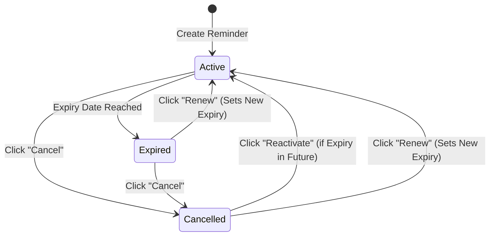

# Subscription Cancellation & Reactivation Workflow

This document outlines the design, implementation, and operational details of the **Subscription Cancellation and Reactivation** feature implemented in the Reminder App.

---

## 1. Feature Overview

The cancellation and reactivation feature allows users to halt reminders/notifications for specific subscriptions without deleting the records from the database. This ensures historical data remains intact while allowing full control over active notification channels.

---

## 2. Status States & Lifecycle

Subscriptions can transition between the following states:

| Status | Code Value | UI Badge | Reminders Sent? | Next Actions Allowed |
| :--- | :--- | :--- | :--- | :--- |
| **Active** | `"active"` | **Green** | **Yes** (based on `reminderAt` calculation) | Edit, Renew, Cancel, Delete |
| **Expired** | `"expired"` | **Red** | **No** (automatic expiry check) | Edit, Renew, Cancel, Delete |
| **Cancelled** | `"cancelled"` | **Gray** | **No** (reminder schedule is cleared) | Edit, Renew, Delete, Reactivate (if future), or Renew |

---

## 3. Implementation Details

### 3.1 Schema & Models
* **File**: [models/Reminder.js](file:///d:/reminder-app/backend/models/Reminder.js)
* Added `"cancelled"` to the `status` enum validation values.

### 3.2 Backend Endpoints
* **File**: [routes/reminderRoutes.js](file:///d:/reminder-app/backend/routes/reminderRoutes.js)
  * `POST /api/reminders/:id/cancel` $\to$ Set status to `"cancelled"` and clear `reminderAt`.
  * `POST /api/reminders/:id/reactivate` $\to$ Set status back to `"active"` and recalculate `reminderAt` using the active expiry.

### 3.3 Mongoose Validation Fix for Legacy Records
During testing, we discovered that older database entries created before the `serviceType` schema changes were missing the `serviceType` field. Because this field is marked `required: true` in the schema, calling `.save()` threw validation errors when cancelling/reactivating those records.

* **Fix**: The cancel and reactivate handlers now utilize `save({ validateBeforeSave: false })` to bypass validation check constraints for unrelated fields. This ensures that simple status transitions never fail due to missing schema fields on historical records.

### 3.4 Frontend UI
* **File**: [Dashboard.jsx](file:///d:/reminder-app/frontend/src/pages/Dashboard.jsx)
  * Rendered a **Cancelled** status badge using slate/gray Tailwind styling.
  * Added conditional logic in the actions column:
    * Displays **Cancel** for any subscription not currently cancelled.
    * Displays **Reactivate** (for future expiries) or **Renew** (for expired/past expiries) to resume notifications.

---

## 4. How-To Guide

### How to Cancel a Subscription
1. Navigate to the Subscriptions tab.
2. In the Actions column, click **Cancel**.
3. Confirm the modal prompt (`"Cancel this subscription reminders?"`).
4. The status updates to **Cancelled** and background triggers are removed.

### How to Reactivate a Cancelled Subscription (Future Expiry)
1. In the Actions column of a cancelled item, click **Reactivate**.
2. Confirm the prompt (`"Reactivate this subscription reminders?"`).
3. The status updates back to **Active** and reminders are rescheduled.

### How to Restart an Expired/Cancelled Subscription
1. Click **Renew** in the Actions column.
2. Enter the new activation and expiry dates.
3. The system saves the historical entry, sets the status back to **Active**, and calculates the new notification schedule.
